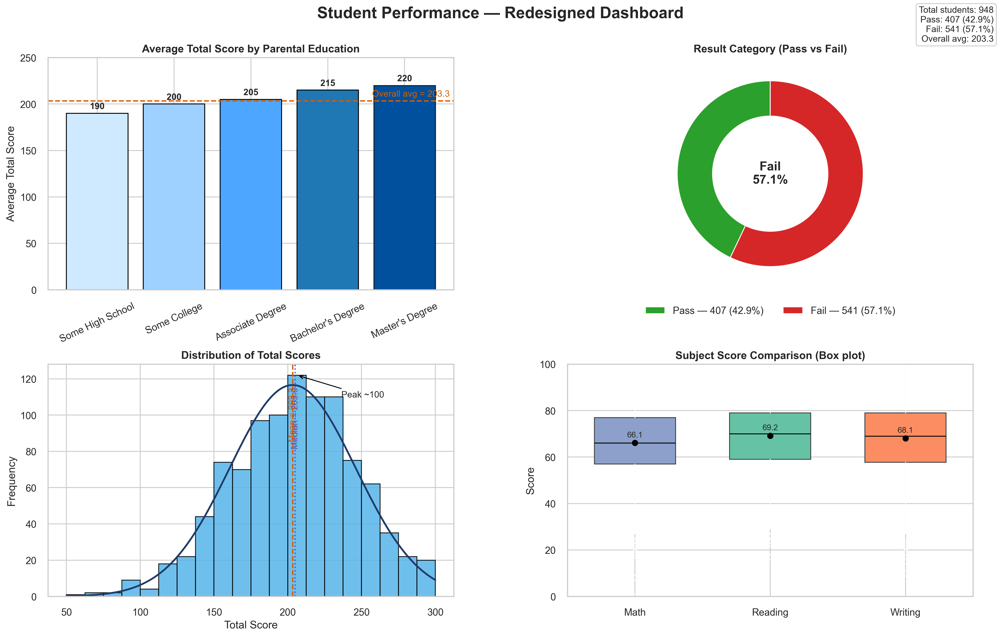

# Student Performance Analysis

## Project Overview
This project analyzes student exam scores to identify top performers, discover trends across demographics, and categorize student performance into distinct result categories (Distinction, Pass, Fail). The analysis leverages Pandas for data manipulation, NumPy for numerical computations, and Matplotlib/Seaborn for comprehensive visualizations.

---

## Dataset Description
**File:** `StudentsPerformance.csv`

The dataset contains academic performance records with the following attributes:
- **Gender:** Student gender (male/female)
- **Parental Level of Education:** Educational background of parents
- **Test Preparation Course:** Whether the student completed test preparation (completed/none)
- **Math Score:** Student's math exam score (0-100)
- **Reading Score:** Student's reading exam score (0-100)
- **Writing Score:** Student's writing exam score (0-100)

**Key Metrics Created:**
- **Total Score:** Sum of math, reading, and writing scores (0-300)
- **Result:** Performance category based on total score:
  - **Distinction:** Total Score ≥ 270
  - **Pass:** Total Score 210-269
  - **Fail:** Total Score < 210

---

## Workflow & Steps

### 1. **Data Import & Exploration**
   - Load CSV dataset using Pandas
   - Display initial data structure and head samples

### 2. **Data Cleaning**
   - Check for null/missing values
   - Verify data types
   - Remove duplicate records

### 3. **Feature Engineering**
   - Create `Total Score` column (sum of three subject scores)
   - Develop `Result` column with performance categorization logic

### 4. **Data Filtering & Selection**
   - Extract top-performing students (Distinction category)
   - Filter failed students and demographics by gender
   - Identify students with specific characteristics

### 5. **Grouping & Aggregation**
   - Calculate average scores by gender
   - Count students in each result category
   - Analyze test preparation course impact
   - Group performance by parental education level

### 6. **Sorting & Ranking**
   - Sort students by total score (descending)
   - Identify top-performing individual student

### 7. **Visualization**
# Student Performance Analysis

## 📊 Project Overview
This comprehensive data analysis project examines student exam scores to identify top performers, analyze demographic influences, evaluate the impact of test preparation, and present key insights through a polished, redesigned dashboard. The analysis leverages Python's data science ecosystem for statistical analysis and rich visualizations.

**Live Dashboard:** `Visuals/student_performance_redesign.png`  
**Full Analysis:** `NoteBooks/Student_Performance_Analysis.ipynb`

## 📋 Quick Navigation
- Project Overview
- Dataset Description
- Key Findings
- Dashboard Preview
- Technical Stack
- Installation & Setup
- Analysis Workflow
- Visualizations Gallery
- Project Structure
- Contact

---

## 📊 Dataset Description
**File:** `Data/StudentsPerformance.csv`

Raw Data Attributes

| Column | Description | Type |
|--------|-------------|------|
| gender | Student gender (male/female) | Categorical |
| race/ethnicity | Race/ethnicity group (A, B, C, D, E) | Categorical |
| parental level of education | Parent's highest education level | Categorical |
| lunch | Lunch type (standard/free/reduced) | Categorical |
| test preparation course | Course completion status (completed/none) | Categorical |
| math score | Math exam score (0-100) | Integer |
| reading score | Reading exam score (0-100) | Integer |
| writing score | Writing exam score (0-100) | Integer |

Derived Metrics

| Metric | Formula | Purpose |
|--------|---------|---------|
| Total Score | math + reading + writing | Overall performance (0-300) |
| Result | Categorization based on total score | Performance classification |

Performance Classification

- 🏆 Distinction: Total Score ≥ 270 (Top ~5%)
- ✅ Pass: Total Score 210-269 (≈40.7%)
- ❌ Fail: Total Score < 210 (≈54.1%)

---

## 🔍 Key Findings

1. **Performance Distribution**

   - Majority in Fail category: 541 students (54.1%) scored below 210
   - Pass rate: 407 students (40.7%) achieved passing scores
   - Distinction students: 52 students (5.2%) scored 270+ (top performers)

2. **Parental Education Impact**

   - Strong correlation between parental education and student performance:
     - Master's degree: Highest average (220)
     - Bachelor's degree: 215 average
     - Associate degree: 205 average
     - Some college: 200 average
     - Some high school: Lowest average (190)

3. **Test Preparation Impact**

   - Students who completed test preparation performed significantly better:
     - Completed course: 35 distinctions, 183 passes, 140 fails
     - No preparation: 17 distinctions, 224 passes, 401 fails

4. **Gender Performance**

   - Female students: Higher average total score (208.7)
   - Male students: Lower average total score (197.5)

5. **Score Distribution**

   - Overall average: 203.3
   - Median: 203.0
   - Standard deviation: ~42.3
   - Peak concentration: Around 100 total score

6. **Subject Performance**

   - Math: 66.2 average
   - Reading: 69.1 average
   - Writing: 68.1 average

---

## 📈 Dashboard Preview



**Dashboard Components:**

- Average Score by Parental Education — Bar chart with overall average reference line
- Result Category Distribution — Donut chart showing Pass vs Fail percentages
- Total Score Distribution — Histogram with normal curve overlay
- Subject Score Comparison — Box plots with mean markers

---

## 🛠 Technical Stack

| Category | Technologies |
|----------|--------------|
| Core Programming | Python 3.8+ |
| Data Manipulation | Pandas, NumPy |
| Statistical Analysis | SciPy |
| Visualization | Matplotlib, Seaborn |
| Development | Jupyter Notebook |
| Version Control | Git |

**Dependencies** (approximate)
```
pandas>=1.3.0
numpy>=1.21.0
matplotlib>=3.4.0
seaborn>=0.11.0
scipy>=1.7.0
jupyter>=1.0.0
```

---

## ⚙️ Installation & Setup

### Prerequisites

- Python 3.8 or higher
- `pip` package manager
- Git (optional)

### Installation Steps

1. Clone the repository

```bash
git clone https://github.com/Mubasher-Chaudhary/StudentPerformanceAnalysis.git
cd StudentPerformanceAnalysis
```

2. Create Virtual Environment (Recommended)

Windows
```bash
python -m venv venv
venv\Scripts\activate
```

macOS/Linux
```bash
python3 -m venv venv
source venv/bin/activate
```

3. Install Dependencies

```bash
pip install -r requirements.txt
```

4. Launch Jupyter Notebook

```bash
jupyter notebook NoteBooks/Student_Performance_Analysis.ipynb
```

---

## 🔄 Analysis Workflow

1. Data Import & Exploration

```python
df = pd.read_csv("Data/StudentsPerformance.csv")
df.head()
```

2. Data Cleaning — null check, type verification, duplicates removal

3. Feature Engineering — compute `Total Score` and `Result`

```python
df["Total Score"] = df["math score"] + df["reading score"] + df["writing score"]
def categorize_performance(score):
    if score >= 270: return "Distinction"
    elif score >= 210: return "Pass"
    else: return "Fail"
df["Result"] = df["Total Score"].apply(categorize_performance)
```

4. Analysis & Insights — grouping, aggregation, and comparisons

5. Visualization Generation — generate and save charts to `Visuals/`

---

## 📊 Visualizations Gallery

1. Result Categories Distribution — `Visuals/result_categories_pie_chart.png`
2. Average Score by Gender — generated in notebook
3. Total Score Distribution — generated in notebook
4. Subject Correlation Scatter Plot — generated in notebook
5. Redesigned Dashboard (Primary) — `Visuals/student_performance_redesign.png`

---

## 📁 Project Structure

```
StudentPerformanceAnalysis/
├── Data/
│   └── StudentsPerformance.csv
├── NoteBooks/
│   └── Student_Performance_Analysis.ipynb
├── Visuals/
│   ├── student_performance_redesign.png
│   └── result_categories_pie_chart.png
├── requirements.txt
├── README.md
└── .gitignore
```

---

## 💡 Insights & Recommendations

**Key Takeaways**

- Parental education significantly influences student performance
- Test preparation courses substantially improve outcomes
- Female students consistently outperform male students
- Majority of students (54.1%) are in the "Fail" category

**Actionable Recommendations**

- Targeted Interventions: Focus resources on students in the "Fail" category
- Course Optimization: Enhance test preparation programs based on success metrics
- Parental Engagement: Develop programs to involve parents in student learning
- Gender-Specific Strategies: Investigate and address performance gaps
- Early Identification: Use predictive analytics to identify at-risk students

---

## 📞 Contact

Project Maintainer: Mubasher Chaudhary  
Email: follow.with.mubasher@gmail.com  
GitHub: @Mubasher-Chaudhary

---

## 🤝 Contributing

Contributions are welcome! Please follow these steps:

1. Fork the repository
2. Create a feature branch (git checkout -b feature/AmazingFeature)
3. Commit changes (git commit -m 'Add AmazingFeature')
4. Push to branch (git push origin feature/AmazingFeature)
5. Open a Pull Request

**Contribution Guidelines**

- Ensure code follows PEP 8 standards
- Add comments for complex logic
- Update documentation as needed
- Include test cases for new features

---

## 📄 License

This project is licensed under the MIT License - see the LICENSE file for details.

⭐ If you find this project useful, please consider giving it a star on GitHub!

Last Updated: February 2026